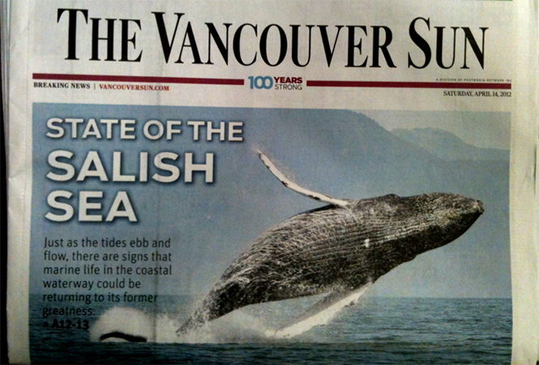
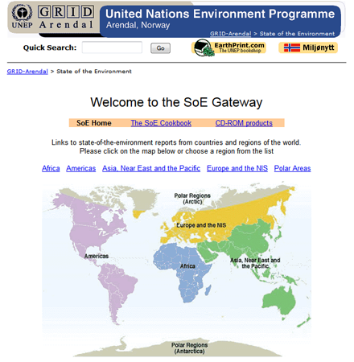
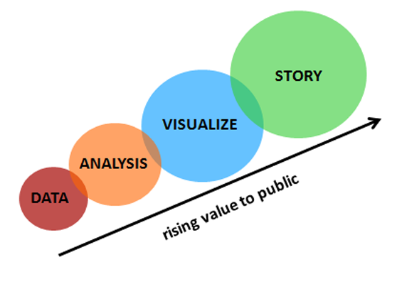
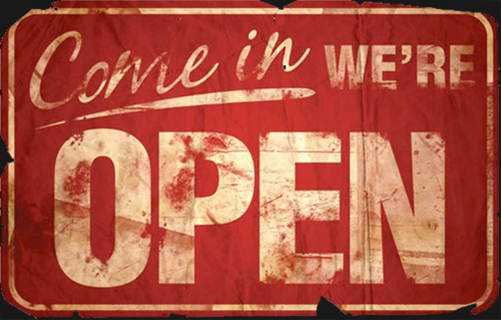
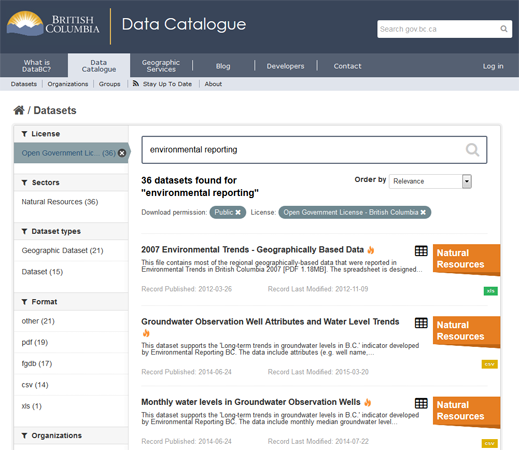
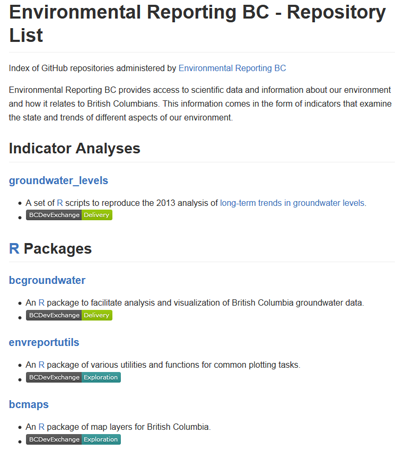

## Slide 1

This is an R Markdown presentation. Markdown is a simple formatting syntax for authoring HTML, PDF, and MS Word documents. For more details on using R Markdown see <http://rmarkdown.rstudio.com>.

When you click the **Knit** button a document will be generated that includes both content as well as the output of any embedded R code chunks within the document.

Store images in the 'img' folder and include them like this: 
    
    OR, for more control, use html: 
      <center></center>

## Slide with Bullets

- Bullet 1
- Bullet 2
- Bullet 3

<div class="notes">
To add speaker notes, include them in a div with class="notes", like this
</div>

## Slide with R Code and Output

```{r}
summary(cars)
```

## Slide with Plot

```{r, echo=FALSE}
plot(cars)
```

## Some Boilerplate EnvReportBC Slides follow

## State of Environment Reporting {.flexbox .vcenter}



<div class="notes">
State of Environment: snapshot in space/time of how things are looking in one area. To provide and communicate credible, timely and accessible basic (non-technical) information on the environment to the public, dm, others .
</div>

## State of Environment Reporting {.flexbox .vcenter}



<div class="notes">
- Global Brand: proliferated in 70’s, Continents/Countries/ States&Provinces/Regional, often a legislated commitment, BC is policy-based
</div>

## SoE: A long History in B.C. {.flexbox .vcenter}


1993-2007

<div class="notes">
- MoE has built a strong foundation for environmental reporting. BC has producing 6 technically sound book-like reports over the past almost 20 years, with a report every 5 years or more. 

- Present the big picture about BC’s environment. We report on status and trends in air, water, land, species & ecosystems, waste and climate change at provincial and regional scales, making links to the economy and human wellbeing where we can.
</div>

## State of Environment Reporting

<div class="columns-2">
> *"The public want results of technical data explained in common language"*

- Water Web 2.0 Strategy


</div>

## Value-Added Reporting Products {.flexbox .vcenter}



<div class="notes">
- 'Tailored' reporting products
- INFOGRAPHICS, PLAIN LANGUAGE SUMMARIES for the public and for engagement
- INDICATOR SUMMARIES and DATAVIZ for students, technicians, policy analysts
- DATA and CODEfor researchers, analysts
</div>

## Reporting Principles {.flexbox .vcenter}



<br/>

Data + Methods (Code) + Open Tools = **Reproducible**

## Data {.flexbox .vcenter}



## Code {.flexbox .vcenter}


