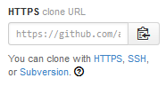

```{r set-options, echo = FALSE}
knitr::opts_chunk$set(eval=FALSE)

```

# Various Use Cases

**Note: This instructions assume you have mapped `I:/SPD/Science Policy & Economics/State of Environment/_dev/` to your `D:/` drive**

## Starting a new project with our own git server as your origin

1) In your bash shell, make new directory for the new indicator in 
  `D:/git_server/[topic]`, then create a *bare* git repo.  This will be the 
  origin you push and pull from (our *local Github*). For this example we will 
  create a "tarballs" indicator in the "Contaminants" topic.

```
cd "D:/git_server/contaminants"
mkdir tarballs
cd tarballs
git init --bare
```

2) Open **RStudio** and load the `envreportbc` library (install/upate if need be):

```{r}
envreportbc::install_local("envreportbc")
library("envreportbc")
```

3) Next, use the function `indicator_skeleton` to create the project. When cloning
  a repo, you should have `path` set to your base development directory as the 
  repository will be cloned into a new folder. Here we use `setwd("c:/_dev/")` 
  to set our working directory, and then can leave the `path` argument as `"."`
  (the default):

```{r}
setwd("c:/_dev/")

indicator_skeleton(path = ".", bucket = "Contaminants", git_init = FALSE, 
                   git_clone = "D:/git_server/contaminants/tarballs")
```

This will clone the empty `tarballs` repository into a new folder called `tarballs`, 
add a default `.gitignore` file, start an RStudio project, and add the boilerplate 
indicator file/folder structure. You can then open the project from RStudio 
and you're off to the races!

## Starting a new project using GitHub as your origin

1) Go to Github and open a new repository with a good name (e.g., `tarballs`). 
  It's best to use the license picker to choose the Apache 2.0 license and add a 
  README file at this stage.

2) Open **RStudio** and load the `envreportbc` library (install/upate if need be):

```{r}
envreportbc::install_local("envreportbc")
library("envreportbc")
```

3) Next, use the function `indicator_skeleton` to create the project. When cloning
  a repo, you should have `path` set to your base development directory as the 
  repository will be cloned into a new folder. Here we use `setwd("c:/_dev/")` 
  to set our working directory, and then can leave the `path` argument as `"."`
  (the default).
  
  Set `git_clone` to be the https link from the repo page on github. 
  You can copy the link by clicking on the button:
  

```{r}
setwd("c:/_dev/")

indicator_skeleton(path = ".", bucket = "Contaminants", git_init = FALSE, 
                   git_clone = "https://github.com/bcgov/tarballs.git")
```

This will clone the `tarballs` repository into a new folder called `tarballs`, 
add a default `.gitignore` file, start an RStudio project, and add the boilerplate 
indicator file/folder structure. It will ask you if you want to overwrite the 
README.md and LICENSE files. You should probably say no! You can then open the 
project from RStudio and you're off to the races!


## Starting a new standalone project (with or without git)

1) Open **RStudio** and load the `envreportbc` library (install/upate if need be):

```{r}
envreportbc::install_local("envreportbc")
library("envreportbc")
```

3) Next, use the function `indicator_skeleton` to create the project. 
  - If you have already created a folder to work in, set your working directory 
  to that folder, and specify `path="."`:

```{r}
setwd("c:/_dev/tarballs") ## Assuming this directory already exists)

indicator_skeleton(path = ".", bucket = "Contaminants", git_init = FALSE)
```
  
  - If you haven't yet created the directory, set your working directory to your
    root development folder, and specify the name of the folder you want to create
    in `path`:
    
```{r}
setwd("c:/_dev")

indicator_skeleton(path = "tarballs", bucket = "Contaminants", git_init = FALSE)
```


# Git notes

## If you need to move an origin:

- Open a shell and navigate to your local repository.  Make sure all your 
branches are up to date by checking out each branch and pulling from the current origin

```
cd c:/dev/[indicator]
git status
git branch ##lists the branches
git checkout [branchname]
git pull origin [banchname]
```

- Then change the url of the origin (likely to our local git_server directory)

```
git remote set-url origin "D:/git_server/[topic]/[indicator]"
git push origin --all
```

## If your Push and Pull buttons in RStudio are greyed out:

From the command line in your local repo, type:
```
git push -u origin master
```
